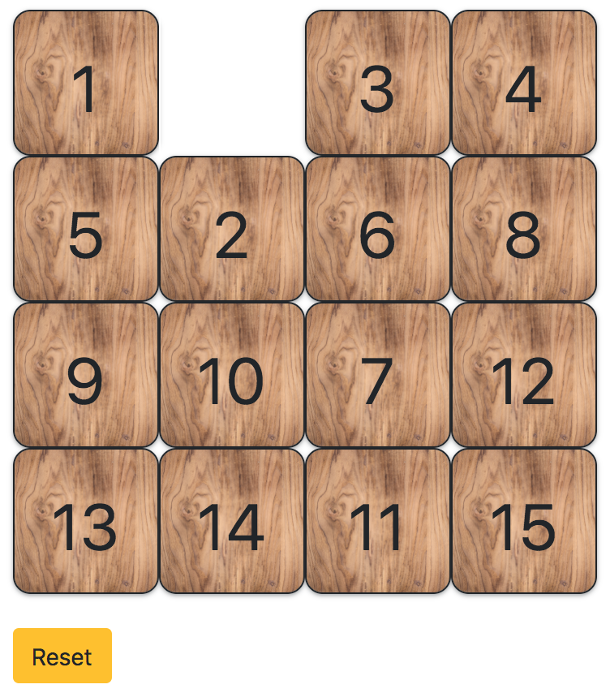

# Sliding blocks puzzle



This is a simple javascript implementation of the [15 puzzle game](https://en.wikipedia.org/wiki/15_puzzle). To view it, visit: [neerajkulk.github.io/sliding_blocks/](https://neerajkulk.github.io/sliding_blocks/)

Simply click on the block you want to slide and have fun! The structure of the code involves keeping track of the location of the empty cell globally. This is done using the ```emptyElem``` and ```emptyLoc``` variables. 

When a square is clicked, we first check if the empty square is directly above, below, to the left or right of the clicked square. This is handled in ```checkUp```, ```checkDown```, ```checkLeft``` and the ```checkRight``` functions. The return value from these functions tells us if the square can be shifted. 

If a square can be shifted, we apply the corresponding shift to all squares between the clicked square and the empty square. This is implimented in the ```shiftUp```, ```shiftDown```, ```shiftLeft``` and ```shiftRight``` functions. Lastly we create a generalized function called ```shift``` which handles the process of checking for possible shifts and then applying them. 

For each block in the grid, we add the ```shift``` function as an event listener. When blocks are shifted we also change css class attributes in the ```resetEmptyCell``` function. This gives the game a nice visual such that it looks like an entire row is being slid over.

The code here is a working prototype of the 15 puzzle game and could be extended to include various other features such as:

- solver for the game
- timer for how long it takes to solve the game. 
- A multiplayer game where users can compete online to see who can solve the puzzle the fastest.


